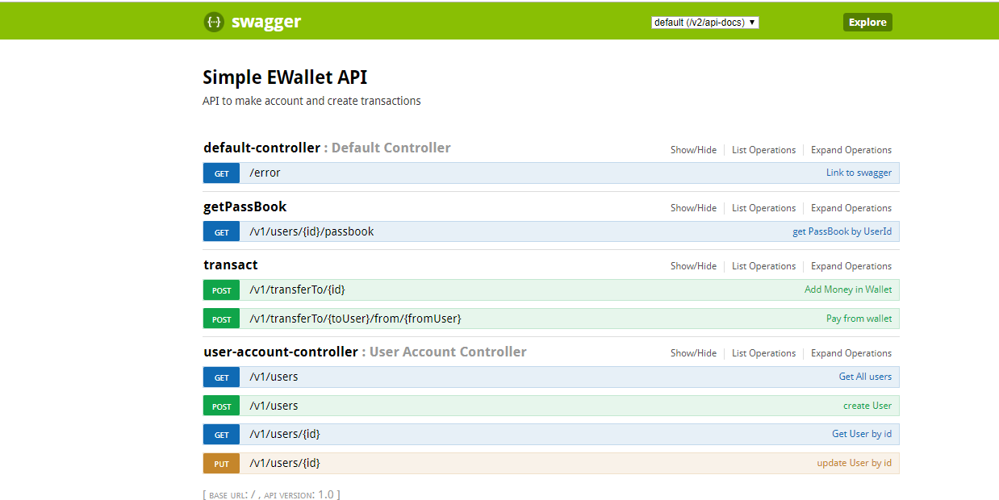

# E Wallet Application

## Problem statement:

Create a User Wallet system where a user can come and register for a wallet. User will be able
to make transactions using wallet
Write APIs for
1. Create a User Account - Sign-in/Sign-up
2. Update/View User Profile
3. Add Money To Wallet
4. Pay Money From Wallet
5. View Passbook - All Transactions

## Installation

- Install Spring Tool Suite, Maven and Java8
- Clone the project and import it as Maven project in Spring Tool Suite
- run `mvn clean install` inside project terminal

## Running App
- run project as Spring Boot Application
- open `http://localhost:8080/swagger-ui.html` in browser
- Enter Parameters in any Api
- Click on Try it Out

## Screenshots

